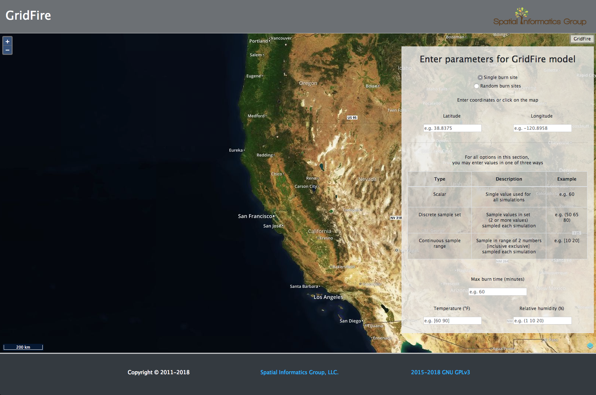
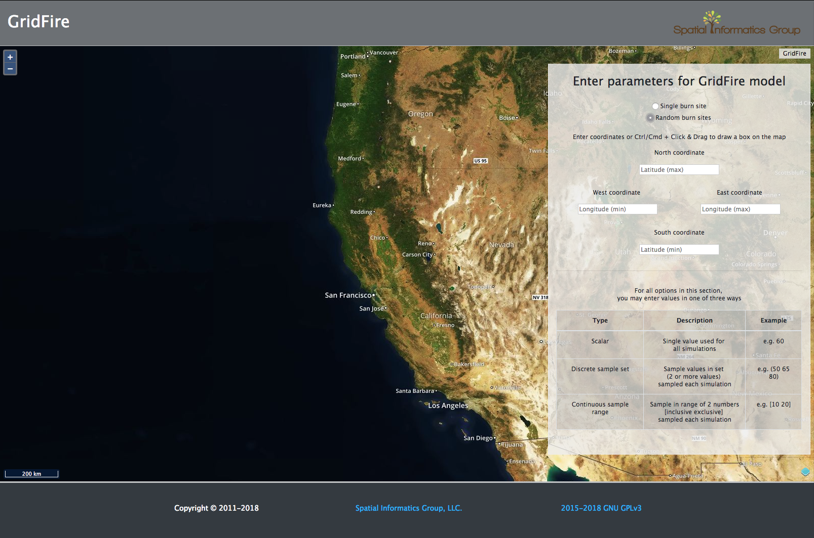

# GridFire UI 

[](https://travis-ci.org/Thru-Echoes/gridfire-ui)

User Interface for GridFire Clojure model.

Single-page web app with *Open Layers* map, using *Express* template engine and *Node.js* JavaScript runtime. 

Localhost at port **3000**. 

## Create data 

GeoTIFF into SQL file

```
raster2pgsql -t auto -I -C FILE.tif landfire.FILE > FILE.sql 
```

SQL into PostgreSQL database 

```
psql -f FILE.sql -U gridfire -d gridfire
```

## User Interface

Screenshots of the GridFire User Interface. Users can click the map to select the latitude and longitude for a single burn site or click-and-drag to create a box where random burn sites in the simulation. 

<br>

May 11, 2018 screenshot of the GridFire UI with single burn option in the parameter form: 

<br>



<br><br>

May 11, 2018 screenshot of the GridFire UI with random burns option in the parameter form:

<br>

 


